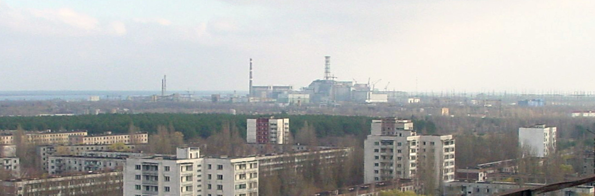

# Chernobyl



A game of cleaning radioactive environment by collecting contaminated
particles. The protoype of this game was developed at Junction 2019,
[Angry Birds in 10 years](https://2019.hackjunction.com/challenges/angry-birds-in-10-years)
game development challenge.

## Objective

Game is scientifically accurate but fun game about finding Bluetooth
or Wi-Fi beacons which represent radioactive sources. The objective is
to clean the environment and get as small dose of radioactivity as
possible. You have to act fast but avoid near exposure to the sources.

In addition having fun with this game you also learn how microwave
radio signals propagate.

## Android application

See https://github.com/klokik/Junction2019Beacons for Android
application. It is not using the same engine as this version yet but
is much more playable.

## Desktop version

This repository has desktop version which will be ported to mobile
platforms after Junction. This doesn't use prerecorded samples but all
audio is rendered in real time using scientifically sound algoritms.


UI prototype is built using Java Swing.

### Processing RSSI to "mock radiation"

[RSSI](https://en.wikipedia.org/wiki/Received_signal_strength_indication)
is logaritmic unit which is converted to linear units. All beacon
powers are then combined by summing.

Power is then integrated into dose by summing the values. It is
converted to Sieverts by multiplying it with a magic number.

If your Bluetooth radio sensitivity needs to be adjusted for a fair
gameplay, see variable *sensitivity* in
[prototype/Radioactivity.java](Radioactivity.java). Note the units are
linear so add one zero to get 10 decibels more.

### Sound generation

The game doesn't show radiation intensity directly but it can be heard
as audible clicks. To get realistic intervals between clicks the
linearized signal strength is applied to
[exponential distribution](https://en.wikipedia.org/wiki/Exponential_distribution)
quantile function as a scaling parameter.

In a certain time (duration of one sample in sound output) the
Geiger-Müller tube either conducts or not. Because we want to
realistically emulate a piezo speaker, we need filtering to make sound
from those boolean values.

First, a binary waveform (output containing only values 0 or 1) is
generated with sample rate of 48kHz. Then it is applied to a FIR
filter which does a band-pass between 1500 ... 4000 Hz which simulates
the physical properties of the speaker case.


This produces a "retro" sound because many modern radiation meters have
oscillator and a speaker instead of this. But we want the sound of the
1980s.

In case you want to tune your speaker, feel free to regenerate FIR
filter. Filter parameters are [attached](prototype/geiger_filter.txt)
and they work with
[GNU Radio Filter Design Tool](http://www.trondeau.com/home/2012/12/19/update-on-filter-design-tool.html).


### Running

Project doesn't yet have a build file so running is a bit manual:

```sh
cd prototype
javac Receiver.java
sudo btmon | java Receiver BEACON_MACS...
```

RSSI is read from Bluetooth stack temporarily using `btmon` until we
get a better solution. After that we no longer require `sudo`.

The game supports multiple beacons, in that case list all beacon MAC
addresses separated by spaces. You can obtain MACs using `btmon`,
[iBKS Config Tool on Android](https://play.google.com/store/apps/details?id=com.accent_systems.ibks_config_tool),
or any other bluetooth scanning tool.

Remember to specify at least one MAC address. Otherwise you get zero
dose and stay healthy for the rest of your life.

## License

This program is free software: you can redistribute it and/or modify
it under the terms of the GNU General Public License as published by
the Free Software Foundation, either version 3 of the License, or (at
your option) any later version. See [license file](LICENSE)
